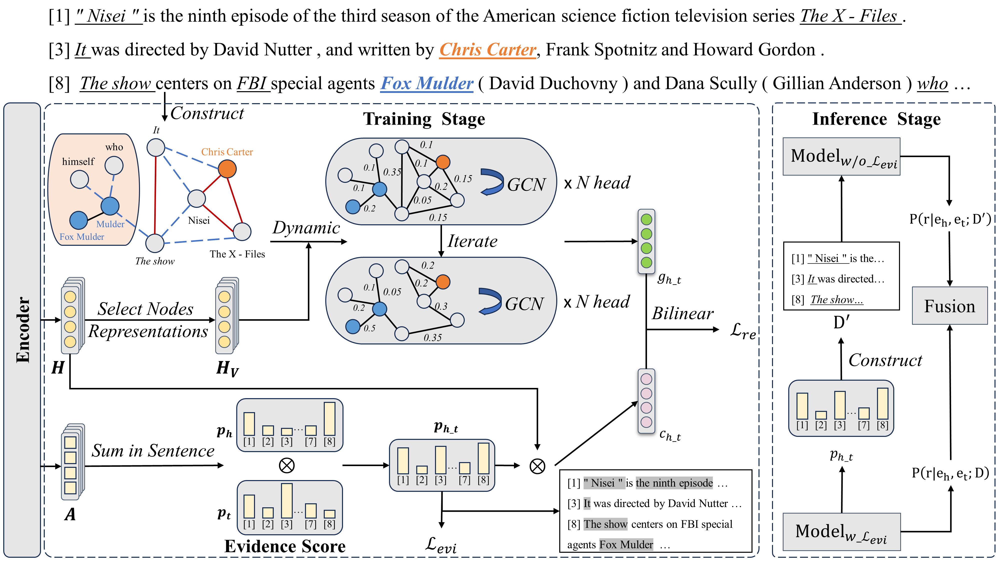

# AA
Code for EMNLP 2023 paper [Anaphor Assisted Document-Level Relation Extraction](https://arxiv.org/abs/2310.18604).

> Document-level relation extraction (DocRE) involves identifying relations between entities distributed in multiple sentences within a document. Existing methods focus on building a heterogeneous document graph to model the internal structure of an entity and the external interaction between entities. However, there are two drawbacks in existing methods. On one hand, anaphor plays an important role in reasoning to identify relations between entities but is ignored by these methods. On the other hand, these methods achieve cross-sentence entity interactions implicitly by utilizing a document or sentences as intermediate nodes. Such an approach has difficulties in learning fine-grained interactions between entities across different sentences, resulting in sub-optimal performance. To address these issues, we propose an Anaphor-Assisted (AA) framework for DocRE tasks. Experimental results on the widely-used datasets demonstrate that our model achieves a new state-of-the-art performance.

## Architecture
 

## Requirements

Packages listed below are required.

- Python (tested on 3.7.2)
- CUDA (tested on 11.3)
- PyTorch (tested on 1.11.0)
- Transformers (tested on 4.18.0)
- spacy (tested on 2.3.7) 
- numpy (tested on 1.21.6)
- opt-einsum (tested on 3.3.0)
- ujson (tested on 5.3.0)
- tqdm (tested on 4.64.0)

## Datasets

Our experiments include the [DocRED](https://github.com/thunlp/DocRED) and [Re-DocRED](https://github.com/tonytan48/Re-DocRED) datasets. The expected file structure is as follows:

```
AA
 |-- dataset
 |    |-- docred
 |    |    |-- train_annotated.json
 |    |    |-- dev.json
 |    |    |-- test.json
 |    |    |-- train_revised.json
 |    |    |-- dev_revised.json
 |    |    |-- test_revised.json
 |-- meta
 |    |-- rel2id.json
 |    |-- rel_info.json
```

## Training
### DocRED
Models trained with and without evidence supervision are required for inference stage cross fusion (ISCF).
```bash
# Model without evidence supervision
bash scripts/run_bert.bash ${name} 0 ${seed} # For Bert
bash scripts/run_roberta.bash ${name} 0 ${seed} # For RoBERTa
# Model with evidence supervision
bash scripts/run_bert.bash ${name} ${lambda} ${seed} # For Bert
bash scripts/run_roberta.bash ${name} ${lambda} ${seed} # For RoBERTa
```
where ${name} represents the identifier for your training, ${lambda} is the weight of evidence supervision, and ${seed} is the random seed.
For example, to train a Bert-based model with evidence supervision on DocRED with a random seed 65, run: ``bash scripts/run_bert.bash bert 0.1 65``


### Re-DocRED
For the Re-DocRED dataset, you should use the model trained on DocRED with evidence supervision to generate token importance distributions.
```bash
bash scripts/infer_redoc_roberta.bash ${load_dir} 
```
Then, you can train the model on Re-DocRED:
```bash
# Model without evidence supervision
bash scripts/run_roberta_revised.bash ${name} ${teacher_signal_dir} 0 ${seed} # for RoBERTa
# Model with evidence supervision
bash scripts/run_roberta_revised.bash ${name} ${teacher_signal_dir} ${lambda} ${seed} # for RoBERTa
```

## Evaluation

### Dev set
The  inference stage cross fusion strategy is applied:
```bash
bash scripts/iscf_bert.bash ${model_dir} ${model_evi_dir} dev # for BERT
bash scripts/iscf_roberta.bash ${model_dir} ${model_evi_dir} dev # for RoBERTa
```
A threshold that minimizes the cross-entropy loss of RE on development set is saved in `${model_evi_dir}`.

### Test set

With `${model_evi_dir}/thresh` available, you can obtain the final predictions on the test set:
```bash
bash scripts/iscf_bert.bash ${model_dir} ${model_evi_dir}  test # for BERT
bash scripts/iscf_roberta.bash ${model_dir} ${model_evi_dir}  test # for RoBERTa
```
A result file `result.json` in the official evaluation format will be generated in `${model_evi_dir}`, which can be submitted to the [DocRED leaderboard](https://codalab.lisn.upsaclay.fr/competitions/365#results).

## Checkpoints
The checkpoints of our models are available at [Google Drive](https://drive.google.com/drive/folders/17hpwwUk76k5OAEHeaF3cwcJb1Ag55NJs?usp=drive_link).

## Citation
Our code is adapted from [ATLOP](https://github.com/wzhouad/ATLOP)[1] and [DREEAM](https://github.com/YoumiMa/dreeam)[2]. Thanks for their good work. If you make use of this code in your work, please kindly cite our paper:
```
@inproceedings{lu-etal-2023-anaphor,
    title = "Anaphor Assisted Document-Level Relation Extraction",
    author = "Lu, Chonggang  and
      Zhang, Richong  and
      Sun, Kai  and
      Kim, Jaein  and
      Zhang, Cunwang  and
      Mao, Yongyi",
    editor = "Bouamor, Houda  and
      Pino, Juan  and
      Bali, Kalika",
    booktitle = "Proceedings of the 2023 Conference on Empirical Methods in Natural Language Processing",
    month = dec,
    year = "2023",
    address = "Singapore",
    publisher = "Association for Computational Linguistics",
    url = "https://aclanthology.org/2023.emnlp-main.955",
    doi = "10.18653/v1/2023.emnlp-main.955",
    pages = "15453--15464",
    abstract = "Document-level relation extraction (DocRE) involves identifying relations between entities distributed in multiple sentences within a document. Existing methods focus on building a heterogeneous document graph to model the internal structure of an entity and the external interaction between entities. However, there are two drawbacks in existing methods. On one hand, anaphor plays an important role in reasoning to identify relations between entities but is ignored by these methods. On the other hand, these methods achieve cross-sentence entity interactions implicitly by utilizing a document or sentences as intermediate nodes. Such an approach has difficulties in learning fine-grained interactions between entities across different sentences, resulting in sub-optimal performance. To address these issues, we propose an Anaphor-Assisted (AA) framework for DocRE tasks. Experimental results on the widely-used datasets demonstrate that our model achieves a new state-of-the-art performance.",
}
```